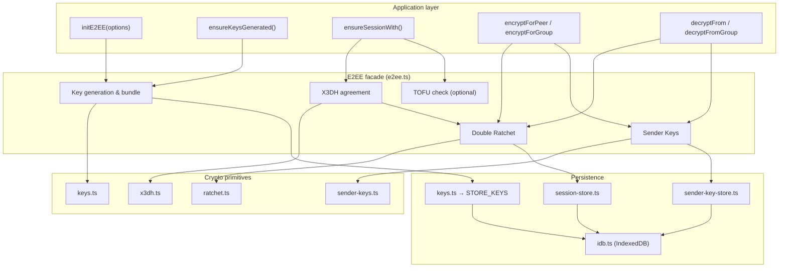

# @runfeed/message-encryption — Architecture & Design

High-level architecture and design of the E2EE messaging layer: components, data flow, wire format, and references.

---

## 1. Architecture overview

The package provides **client-side end-to-end encryption** for 1:1 and group messaging. It does **not** handle key distribution or transport; the app is responsible for uploading/downloading key bundles (e.g. `PUT /me/keys`, `GET /users/:id/keys`) and delivering ciphertext.



---

## 2. Component map

| Component | File | Role |
|-----------|------|------|
| **Facade** | `e2ee.ts` | Single entry point: `initE2EE`, key generation, session setup, encrypt/decrypt (1:1 and group). Wires X3DH → Double Ratchet and Sender Keys; optional TOFU. |
| **Types & options** | `types.ts` | `E2EECryptoOptions`, `TofuAdapter`, `KeyChangedError`; `identityToDhBase64` helper. |
| **Keys** | `keys.ts` | Identity (ECDH + ECDSA), signed prekey, one-time prekeys (P-256). Generation, export/import, persistence in IndexedDB; encrypt-at-rest key derivation. |
| **X3DH** | `x3dh.ts` | X3DH-style key agreement: initiator/responder; derives root key from identity + signed prekey + optional one-time prekey. Root key seeds Double Ratchet. |
| **Double Ratchet** | `ratchet.ts` | DH ratchet + symmetric KDF chains; skipped-key cache for out-of-order messages. AES-GCM with AAD (conversationId, optional messageId). |
| **Sender Keys** | `sender-keys.ts` | One symmetric chain per sender in a group; HKDF chain + skipped keys; per-sender ECDSA P-256 signature over (conversationId, deviceId, iteration, ciphertext). |
| **Session store** | `session-store.ts` | Ratchet state per (conversationId, peerUserId, peerDeviceId). Persisted in IndexedDB; encrypted at rest via identity-derived key. |
| **Sender key store** | `sender-key-store.ts` | Sender key state per (conversationId, senderUserId, senderDeviceId); member snapshot for distribution. IndexedDB, encrypted at rest. |
| **IDB** | `idb.ts` | IndexedDB open, object stores (keys, sessions, senderKeys, verifiedPeers), encrypt/decrypt at rest, get/put/delete. |
| **Padding** | `padding.ts` | Size-bucket padding (`e2ee-pad1:`) to reduce metadata leakage (message length). |

---

## 3. Data flow

### 3.1 One-to-one (1:1)

1. **Setup**  
   App calls `ensureKeysGenerated()` and uploads the bundle. For a conversation, app fetches peer bundle and calls `ensureSessionWith(conversationId, peerUserId, theirBundle, peerDeviceId, myUserId)`.
2. **X3DH**  
   Initiator: our identity + ephemeral, their signed (and optional one-time) prekey → DH combinations → HKDF → root key. Responder: our signed/one-time private keys, their identity + ephemeral from initial message → same HKDF → same root key.
3. **Double Ratchet**  
   Root key initializes ratchet state (DH + chain keys). Each message: derive message key from sending chain, encrypt with AES-GCM (AAD = conversationId [+ messageId]), send header (DH public, PN, N) + IV + ciphertext. Receive: parse header, skip keys if out-of-order (cached), or DH ratchet step, then decrypt and advance receiving chain.
4. **Wire**  
   First message: `e2ee0:deviceId:identityDh:ephemeralDh:signedPreKeyId:oneTimeId:payloadB64`. Subsequent: `e2ee1:deviceId:payloadB64`.

### 3.2 Group

1. **Sender key**  
   Sender creates a sender key state (symmetric chain + optional ECDSA signing key) per (conversationId, myUserId, myDeviceId).
2. **Distribution**  
   Sender key material is distributed to each member over **1:1** sessions: `ensureGroupSenderKey` establishes 1:1 sessions and encrypts the distribution payload with `encryptForPeer`; payloads are sent as `e2ee-senderkey0:<encrypted>`.
3. **Group messages**  
   Encrypt with `encryptForGroup` (sender key chain + optional signature). Wire: `e2ee-group1:deviceId:payloadB64`. Recipients decrypt with `decryptFromGroup` using stored sender key state; signature verified when present.

---

## 4. Wire format (stable)

| Prefix | Meaning |
|--------|---------|
| `e2ee0:` | Initial 1:1 message (X3DH); carries identity, ephemeral, signed prekey id, one-time id, payload. |
| `e2ee1:` | Continuing 1:1 message (Double Ratchet); deviceId + payload. |
| `e2ee-group1:` | Group message (Sender Keys); deviceId + payload. |
| `e2ee-senderkey0:` | Sender key distribution; wraps an encrypted 1:1 payload containing sender key state. |
| `e2ee-pad1:` | Padding wrapper; 2-byte length + payload + padding to size bucket. |

---

## 5. Cryptography summary

- **Curves & algorithms**: ECDH and ECDSA on **P-256**; **AES-GCM** (128-bit tag); **HKDF-SHA-256** for key derivation.
- **Identity**: Long-term ECDH key (agreement) + ECDSA key (signs signed prekey). Format for upload: `base64(dhPub).base64(signPub)`.
- **X3DH**: Four DH shared secrets (with optional one-time) concatenated, then HKDF with fixed salt and info `x3dh-root` → 32-byte root key.
- **Double Ratchet**: KDF-RK(root, DH_output) for root/chain updates; KDF-CK(chainKey) for message keys; skipped-key cache (max 2000) for out-of-order; AAD binds to conversation (and optional messageId).
- **Sender Keys**: HKDF chain (`msg-{n}`); optional ECDSA P-256 signature over (conversationId, senderDeviceId, iteration, ciphertext); AAD for replay/cross-conversation protection.
- **Storage**: Session and sender-key state encrypted at rest with a key derived from identity ECDH private key (ECDH with a fixed public point + HKDF).

---

## 6. References and sources

### Protocols and specifications

- **X3DH — Key agreement**  
  Signal’s X3DH key agreement protocol (asynchronous, forward secrecy, prekey bundles).  
  [Signal: The X3DH Key Agreement Protocol](https://signal.org/docs/specifications/x3dh/)

- **Double Ratchet — 1:1 messaging**  
  Signal’s Double Ratchet Algorithm (DH ratchet + symmetric KDF chains, out-of-order handling).  
  [Signal: The Double Ratchet Algorithm](https://signal.org/docs/specifications/doubleratchet/)

- **Sender Keys / group E2EE**  
  Group encryption pattern: one symmetric chain per sender, distribution over 1:1 channels; used in Signal and others. This implementation adds per-sender ECDSA signatures for group message authentication.  
  [Sender Keys (Wikipedia)](https://en.wikipedia.org/wiki/Sender_Keys)

### Standards and APIs

- **Web Crypto API**  
  Used for key generation, ECDH, ECDSA, AES-GCM, HKDF.  
  [MDN: Web Crypto API](https://developer.mozilla.org/en-US/docs/Web/API/Web_Crypto_API)

- **HKDF**  
  Key derivation (RFC 5869).  
  [RFC 5869 – HMAC-based Extract-and-Expand Key Derivation Function](https://www.rfc-editor.org/rfc/rfc5869)

- **AES-GCM**  
  Authenticated encryption.  
  [NIST SP 800-38D](https://csrc.nist.gov/publications/detail/sp/800-38d/final)

### In this repo

- **Open-sourcing plan and wire format**  
  [docs/open-source-e2ee-crypto.md](../../docs/open-source-e2ee-crypto.md) (monorepo root)
- **Package usage**  
  [README.md](../README.md)

---

## 7. Dependency overview

```
e2ee.ts (facade)
  ├── types.ts
  ├── keys.ts ──────────────────────► idb.ts (STORE_KEYS)
  ├── x3dh.ts ◄── keys.ts
  ├── ratchet.ts
  ├── session-store.ts ◄── ratchet.ts, keys.ts (getStorageEncryptionKey)
  │                     └── idb.ts (STORE_SESSIONS, encrypt/decrypt at rest)
  ├── sender-keys.ts
  ├── sender-key-store.ts ◄── sender-keys.ts, keys.ts, idb.ts (STORE_SENDER_KEYS)
  └── padding.ts (optional; used by app)
```

The app depends only on the public API (see `index.ts`); it must call `initE2EE(options)` once and is responsible for key distribution and message transport.
